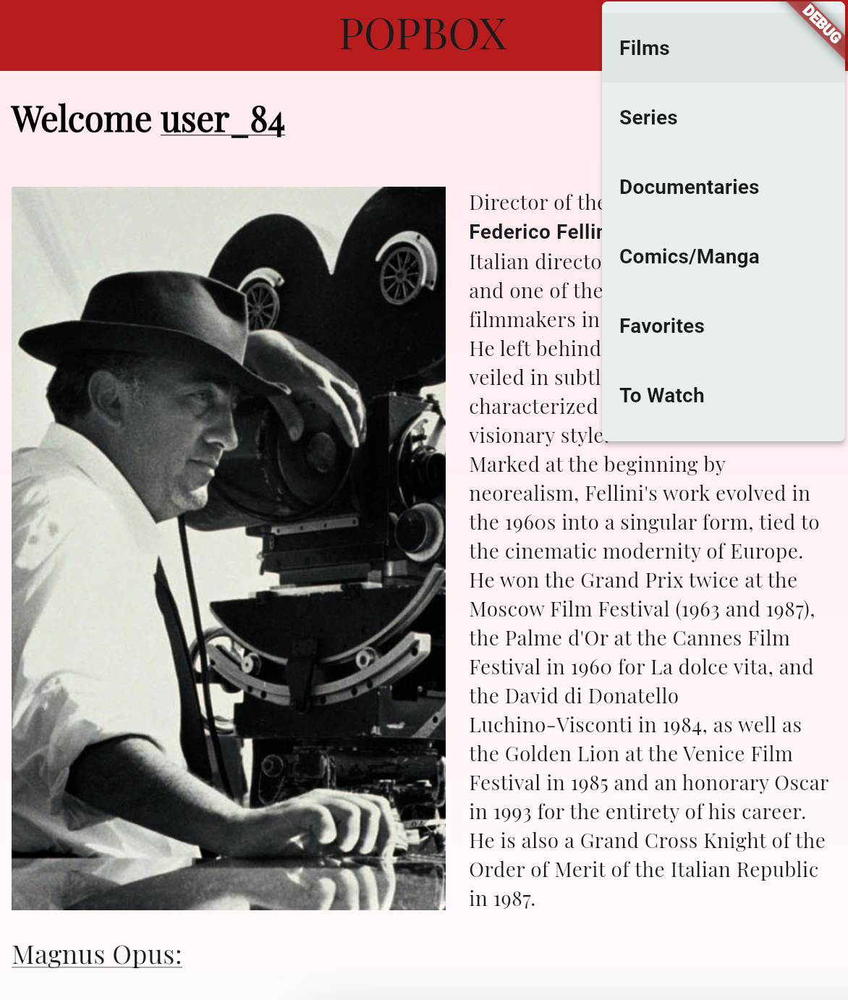

# TP1 - Movie Platform

TP1 is a movie platform that allows users to browse through various films, documentaries, and series. The application features a clean and intuitive interface that enhances the user experience while exploring different media content.

## Features

- **Home Page**: The landing page of the application provides a welcoming introduction and highlights featured content.

- **Menu Bar**: Located at the top right corner, the menu bar includes various tabs such as:

- [Films](TP1/filmsfavoris.jpeg)
- Documentaries
- Series
- Comics/Manga
- [Favorites](TP1/favories.jpeg)
- To Watch

## Note

> The Menu button is hidden behind the debug banner. Make sure to check the top right corner of the app to access the menu options.
