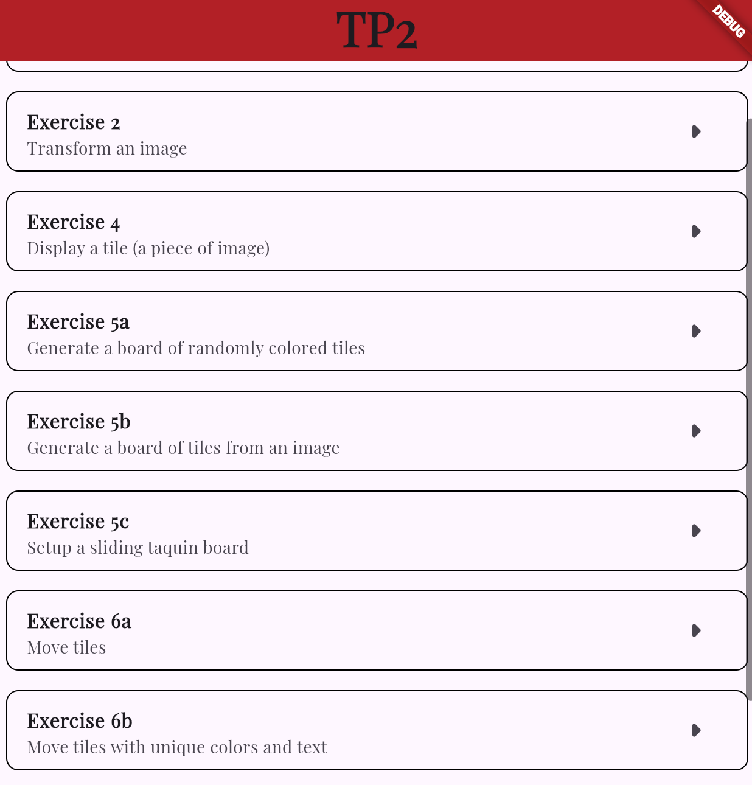
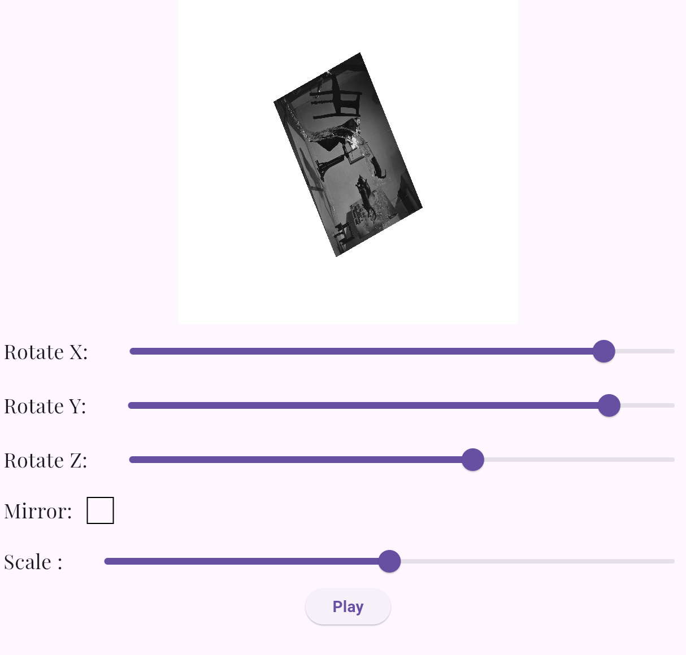
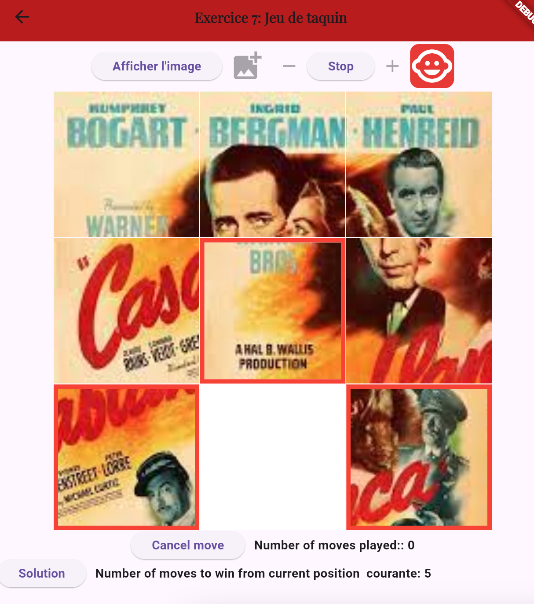
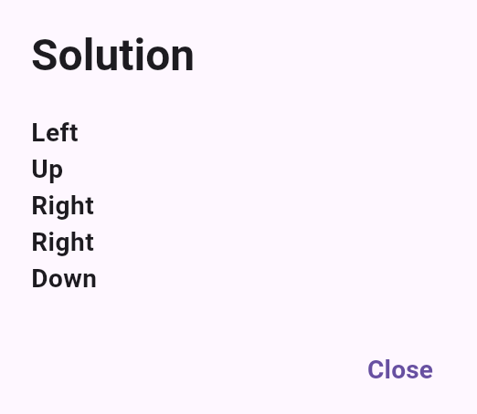

# Flutter Project TP2 - Jeu de taquin

## Description

In this section, I developed a **Jeu de Taquin** with multiple stages and difficulty levels. This game includes a selection menu that allows users to choose between the different exercises. Each exercise is designed to demonstrate specific functionalities and concepts related to image manipulation and puzzle-solving.

## Goal

The goal of this project is to create an engaging and educational experience that combines game mechanics with algorithmic problem-solving, specifically using the A\* algorithm to solve the sliding puzzle.

## Menu of Exercises

The game features a menu where various exercises are stored. Each exercise focuses on a different aspect of the project, allowing users to explore different functionalities. For example, one exercise involves the transformation of an image, where users can see how image manipulation techniques can be applied within the context of the puzzle.

## A\* Algorithm

The **Jeu de Taquin**, also known as "Taquin," is solved using the A\* search algorithm, which is designed to efficiently find the shortest path to the goal state. For example, in the following game:

the solution will be something like:

## Options

In the game, you have various customization options, such as changing the difficulty, selecting the color scheme, choosing the image, and undoing your moves.
